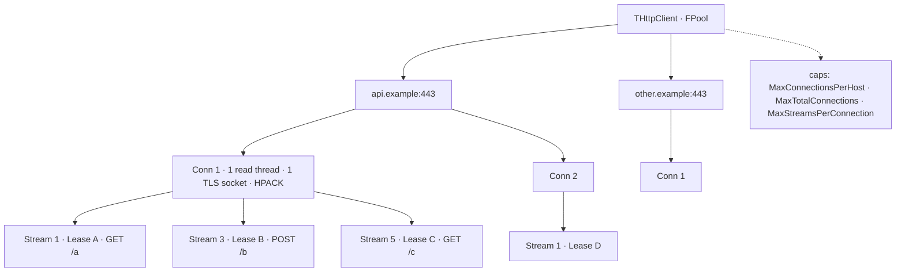
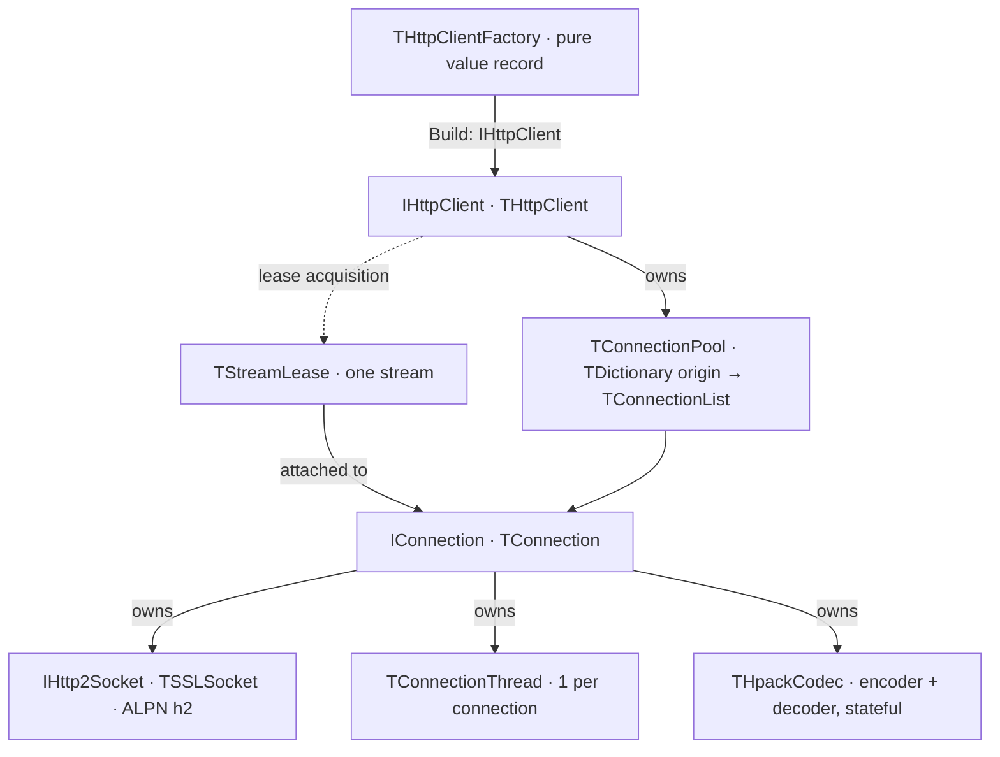

# Architecture

## Resolved multiplexing model

The original sketch contained three statements that cannot all hold at once:
the pool is capped by total connections, "when 4 leases go out it creates a
new connection", *and* leases queue frames on the connection they are
attached to. This design resolves them as follows and the rest of the design
depends on it:

- **A lease is one HTTP/2 stream, not one TCP connection.** A single
  connection multiplexes many concurrent leases/streams.
- **Two connection caps bound TCP connections**: `MaxConnectionsPerHost`
  caps concurrent connections to one `host:port`, and `MaxTotalConnections`
  caps them across all hosts combined. Neither is a cap on in-flight
  requests.
- **Concurrency of requests is bounded separately** by
  `MaxStreamsPerConnection` (and by the peer's advertised
  `SETTINGS_MAX_CONCURRENT_STREAMS`).
- When a new lease is requested, the client reuses the least-loaded open
  connection for that `host:port` if it has a free stream slot; otherwise it
  opens a new connection (until `MaxConnectionsPerHost` /`MaxTotalConnections`);
  otherwise the lease waits.



## Component diagram



Layering, top down:

1. **`THttpClientFactory`** — immutable builder record; produces a configured
   `IHttpClient`. See [[client-api]].
2. **`IHttpClient` / `THttpClient`** — public entry point, thread-safe,
   owns the pool, hands out leases. `Send` may be called concurrently.
3. **`TConnectionPool`** — `TDictionary<string, TConnectionList>` guarded by
   a `TCriticalSection`. Enforces the per-host `MaxConnectionsPerHost` budget
   and the global `MaxTotalConnections` budget.
4. **`IConnection` / `TConnection`** — owns one socket, one background
   thread, and all connection-scoped HTTP/2 state (HPACK, settings, windows,
   stream-id counter). See [[transport]].
5. **`TStreamLease` / stream state** — one request/response exchange.

## Unit layout and naming

Fifteen units in `src/`, listed in dependency order:

```pascal
unit Http2.Errors;      // EHttpError hierarchy, THttp2ErrorCode
unit Http2.Frames;      // TFrameType, TFrame, TFrameHeader, TConnectionSettings
unit Http2.Headers;     // IHttpHeaders, THttpHeaders, header-name constants
unit Http2.Hpack;       // THpackCodec (static + dynamic tables)
unit Http2.FlowControl; // TWindow, connection/stream window accounting
unit Http2.Tls;         // IHttp2Socket, ALPN, TLS context, cert validation,
                        // TClearTextPolicy, TNegotiatedProtocol
unit Http2.Messages;    // IHttpResponse, IResponseReader<T> (re-exports TLS enums)
unit Http2.Http1;       // THttp1Connection, HTTP/1.1 codec + h2c upgrade
unit Http2.Connection;  // TConnection, TConnectionThread, IConnectionStream,
                        // IBlockingQueue<T>, TBlockingQueue<T>
unit Http2.Stream;      // TStreamLease, THttpMethod, THttpBody, IBodyWriter,
                        // IHttpBodyStream, TStreamIdAllocator
unit Http2.Observer;    // IHttp2Observer
unit Http2.Client;      // THttpClientFactory, IHttpClient, THttpRequest,
                        // TConnectionPool, IPooledConnection,
                        // THttpConnection, THttp1PooledConnection,
                        // IHttp2SocketFactory, TResponseReader<T>,
                        // WithTextBody / ReadText
unit Http2.Readers;     // optional: JSON/XML readers + send helpers (fcl-json/fcl-xml)
unit Http2.Sse;         // TSseEventParser, TSseSource, TSseReconnectLoop, SseRequest
unit Http2;             // umbrella: re-exports every unit above EXCEPT Http2.Readers
```

`Http2.Readers` is deliberately **outside** the umbrella and the 14-unit
core: it is the only unit that depends on `fcl-json`/`fcl-xml`, so a caller
links it only by naming it in their own `uses` clause. See [[messages]].

**Dependency direction.** `Http2.Client` and `Http2.Connection` are the
concurrency owners; the layers below them are pure and independently
testable. `Http2.Messages` re-exports `TClearTextPolicy` and
`TNegotiatedProtocol` from `Http2.Tls`, so a caller that only needs the
public message types does not pull in the socket layer's details.

Conventions:

- **Unit names**: `Http2.<Area>`, dotted, one class per unit where practical.
- **Types**: `T` prefix for classes/records, `I` prefix for interfaces,
  `E` prefix for exceptions, `F` prefix for fields.
- **Parameters**: `A` prefix (`ARequest`, `AValue`), `const` for managed
  types (avoids an implicit copy + refcount churn).
- **Header-name constants** are lowercase (`HeaderContentType` = `'content-type'`)
  because HTTP/2 requires lowercase on the wire. See [[messages]].
