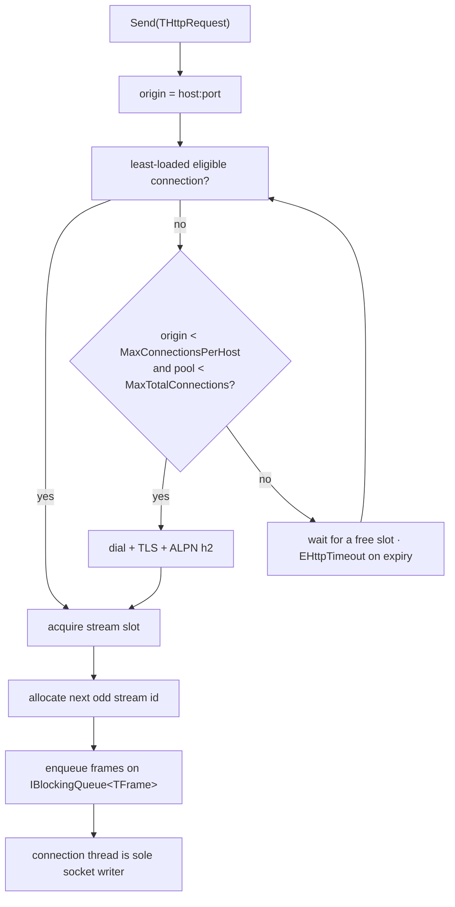

# Client API

## HttpClientFactory

> **Original sketch (superseded):** the factory was described only as
> `HttpClientFactory.WithMaxConnections(max:int=4)`,
> `.WithFollowRedirects(follow=true)`, `.WithProxy(host,port)`, `.Build()`,
> with the note that "when 4 leases go out it creates a new connection".
> That last clause is wrong under the resolved model — see
> [[architecture]]. The connection cap was later split into a per-authority
> cap and a pool-wide cap, because a high-concurrency client needs to bound
> each host tightly while still allowing many hosts.

```pascal
type
  THttpClientFactory = record
  private
    FMaxConnectionsPerHost: Integer;
    FMaxTotalConnections: Integer;
    FMaxStreamsPerConnection: Integer;
    FFollowRedirects: Boolean;
    FMaxRedirects: Integer;
    FConnectTimeoutMs: Integer;
    FHeaderTimeoutMs: Integer;
    FIdleTimeoutMs: Integer;
    FProxyHost: string;
    FProxyPort: Word;
    FSocketFactory: IHttp2SocketFactory;   // test seam / custom transport
    FCACertFile: string;                   // trust anchor bundle
    FInsecure: Boolean;                    // skip certificate verification
    FObserver: IHttp2Observer;
    FHttp1Fallback: Boolean;
    FClearTextPolicy: TClearTextPolicy;
  public
    class function Create: THttpClientFactory; static;
    function WithMaxConnections(const AMax: Integer): THttpClientFactory;
    function WithMaxConnectionsPerHost(const AMax: Integer): THttpClientFactory;
    function WithMaxTotalConnections(const AMax: Integer): THttpClientFactory;
    function WithMaxStreamsPerConnection(const AMax: Integer): THttpClientFactory;
    function WithFollowRedirects(const AFollow: Boolean): THttpClientFactory;
    function WithMaxRedirects(const AMax: Integer): THttpClientFactory;
    function WithProxy(const AHost: string; const APort: Word): THttpClientFactory;
    function WithConnectTimeout(const AMs: Integer): THttpClientFactory;
    function WithHeaderTimeout(const AMs: Integer): THttpClientFactory;
    function WithIdleTimeout(const AMs: Integer): THttpClientFactory;
    function WithSocketFactory(const AFactory: IHttp2SocketFactory): THttpClientFactory;
    function WithCACertFile(const AFileName: string): THttpClientFactory;
    function WithInsecureTls(const AInsecure: Boolean = True): THttpClientFactory;
    function WithHttp1Fallback(const AEnable: Boolean = True): THttpClientFactory;
    function WithClearText(const APolicy: TClearTextPolicy): THttpClientFactory;
    function WithObserver(const AObserver: IHttp2Observer): THttpClientFactory;
    function Build: IHttpClient;
    // read-only accessors: MaxConnections, MaxConnectionsPerHost,
    // MaxTotalConnections, MaxStreamsPerConnection, FollowRedirects,
    // MaxRedirects, ConnectTimeoutMs, HeaderTimeoutMs, IdleTimeoutMs,
    // CACertFile, Http1Fallback, Observer
  end;
```

The factory is a **pure value record**: every `WithX` returns a new record
with one field changed, so a stored factory can be reused and forked without
shared mutable state. `Build` allocates the `IHttpClient` and its pool.

Defaults:

| Setting | Default | Meaning |
|---|---|---|
| `MaxConnectionsPerHost` | `4` | concurrent TCP connections to one authority (`host:port`) |
| `MaxTotalConnections` | `32` | concurrent TCP connections across every authority combined |
| `MaxStreamsPerConnection` | `100` | concurrent streams per connection offered to the peer |
| `FollowRedirects` | `True` | automatic redirect handling (see [[errors-redirects]]) |
| `MaxRedirects` | `10` | redirect chain limit before `EHttpTooManyRedirects` |
| `ConnectTimeoutMs` | `10000` | TCP + TLS handshake deadline |
| `HeaderTimeoutMs` | `30000` | response-header deadline once headers are expected |
| `IdleTimeoutMs` | `60000` | idle connection reap time |
| `Http1Fallback` | `False` | allow HTTP/1.1 when the peer does not offer `h2`; see [[fallback]] |
| `ClearTextPolicy` | `ctReject` | reject `http` origins; see [[fallback]] |

Two connection caps apply, because a pool has two different budgets: a
**per-authority** one (how many TCP connections may serve one `host:port`, a
parallelism/reuse decision) and a **pool-wide** one (how many file descriptors
and TLS states the client may hold in total, a resource decision).
`MaxStreamsPerConnection` is the per-connection request cap and is applied on
top of the peer's `SETTINGS_MAX_CONCURRENT_STREAMS` (whichever is smaller).

RFC 9113 section 9.1 says a client *SHOULD NOT* open more than one HTTP/2
connection to a given host and port, so `MaxConnectionsPerHost = 1` is the
most conformant choice and is what a single-authority client wants. The
default of `4` keeps headroom for a small number of connections to share the
load; raise it only with a measurement. High-concurrency workloads that would
rather open a few connections than expose very wide multiplexing should lower
`MaxStreamsPerConnection` (say to `20`–`50`) and set
`MaxConnectionsPerHost` in the `1`–`4` range, e.g. `WithMaxConnectionsPerHost(2)`
with `WithMaxTotalConnections(128)`.

`WithMaxConnections(max)` is retained as a compatibility shim: it sets **both**
caps to `max`, which is the historic meaning for a single-authority pool.
Prefer `WithMaxConnectionsPerHost` / `WithMaxTotalConnections`.

`WithProxy(host, port)` routes every dial through an HTTP `CONNECT` tunnel
to `host:port`; the tunnel is established on the plain socket, so TLS and
ALPN still target the origin. A proxy that refuses the `CONNECT` surfaces as
`EHttpConnectionError`; there is no forwarding mode and no silent direct
fallback. See [[transport]].

The three timeout setters take a single value each — `WithConnectTimeout`,
`WithHeaderTimeout`, `WithIdleTimeout` — and override the matching default
below for every request on the built client. See [[errors-redirects]].

`WithSocketFactory` replaces the transport wholesale. It is the seam the
test suite uses (`IHttp2SocketFactory` with an in-memory socket) and the
hook for a caller who must supply their own TLS stack. `WithCACertFile`
points certificate verification at a specific trust bundle;
`WithInsecureTls` disables verification (test/development only, never a
default). `WithObserver` installs an `IHttp2Observer` for connection,
stream, and frame-level events — see [[testing-observability]].

### TLS and trust

| Setting | Default | Meaning |
|---|---|---|
| `SocketFactory` | `TDefaultSocketFactory` | the socket/TLS implementation; overridable for tests |
| `CACertFile` | empty (system store) | PEM trust anchor bundle used to verify the peer |
| `Insecure` | `False` | when true, skip certificate and hostname verification |

`Insecure` is exposed for tests and local servers only. It is not set by
any example and is not reachable through the plain `Create` defaults.

Fluent use:

```pascal
var
  Client: IHttpClient;
begin
  Client := THttpClientFactory.Create
    .WithMaxConnectionsPerHost(2)
    .WithMaxTotalConnections(8)
    .WithMaxStreamsPerConnection(50)
    .WithFollowRedirects(False)
    .Build;
end;
```

## HttpClient

```pascal
type
  IHttpClient = interface
  ['{6B1C2D3E-4F50-4A61-9C72-000000000001}']
    function Send(const ARequest: THttpRequest): IHttpResponse;
    procedure Close;
  end;
```

`Send` **blocks until response status and headers are available**, then
returns an `IHttpResponse` whose body can be streamed or drained (see
[[messages]]). It does not block until the body is complete. `Send` is
thread-safe and may be called concurrently from many threads; each call
acquires its own stream lease.

`Close` stops accepting new leases, gracefully closes open connections
(GOAWAY, see [[transport]]), and releases the pool. Outstanding
`IHttpResponse` bodies remain readable until they complete or the caller
releases them.

### Lease acquisition

`Send` performs these steps under the pool's `TCriticalSection`:

1. Compute `Origin` from the request URL (`host:port`; default port by
   scheme). This becomes the `:authority` pseudo-header.
2. Look up the connection list for `Origin` and choose the **least-loaded
   eligible** connection — one that is open (or opening) and whose active
   stream count is below both `MaxStreamsPerConnection` and the peer's
   advertised `SETTINGS_MAX_CONCURRENT_STREAMS`.
3. If none is eligible and the origin count is below
   `MaxConnectionsPerHost` and the pool count is below `MaxTotalConnections`,
   **open a new connection** for `Origin` and use it.
4. Otherwise **wait** for a slot to free (bounded by the configured
   timeouts, else `EHttpTimeout`).
5. Allocate the next odd stream id on the chosen connection, build a
   `TStreamLease`, and enqueue the request frames on the connection's
   `TBlockingQueue<TFrame>`.



The connection thread is the **sole writer** to the socket: callers never
touch the socket directly, they only enqueue frames. This keeps
HPACK encoder state and flow-control accounting single-threaded on the
write side. See [[transport]] for the queue design and [[protocol]] for
flow control.
