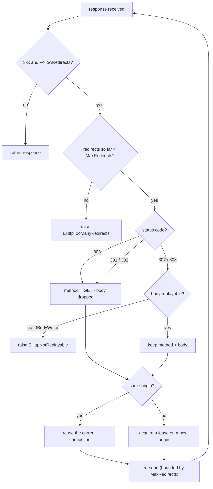
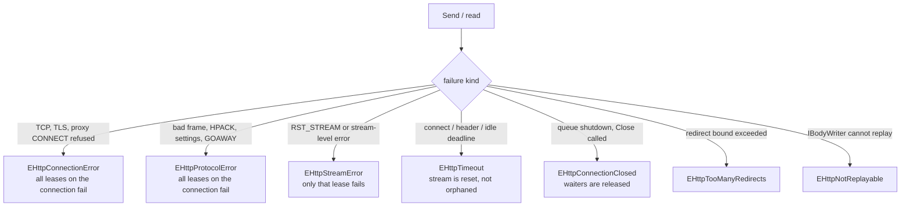

# Errors, Timeouts & Redirects

## Redirects

When `WithFollowRedirects` is on and a `3xx` carries a `Location`:

- A cross-origin redirect requires a different connection/lease; do not
  reuse the current one.
- Method/body rewriting follows the standard rules (`303` → GET, no body;
  `307`/`308` preserve method and body only if the body is a replayable
  `THttpBody`; an `IBodyWriter` body cannot be replayed and the redirect
  fails with `EHttpNotReplayable`).
- Redirect count is bounded by `MaxRedirects`; exceeding it raises
  `EHttpTooManyRedirects`.



## Error handling and timeouts

Exception hierarchy (all derive from `EHttpError`):

```pascal
type
  EHttpError            = class(Exception);
  EHttpConnectionError  = class(EHttpError);   // fails all leases on the conn
  EHttpProtocolError    = class(EHttpError);
  EHttpStreamError      = class(EHttpError);   // RST_STREAM; conn survives
  EHttpTimeout          = class(EHttpError);
  EHttpConnectionClosed = class(EHttpError);
  EHttpTooManyRedirects = class(EHttpError);
  EHttpNotReplayable    = class(EHttpError);
```

- **Connection errors** (transport failure, protocol error, `GOAWAY`,
  `COMPRESSION_ERROR`, settings error) fail all in-flight leases.
- **Stream errors** (`ftRstStream` or stream-level protocol error) fail only
  that lease.
- **Cancellation:** abandoning a `Send`/`Read` sends `RST_STREAM` with
  `CANCEL` and releases the lease. A request may carry an
  `ICancellationToken` (`THttpRequest.WithCancelToken`); cancelling it resets
  the stream in flight.
- **Timeouts:** the factory sets three defaults — `WithConnectTimeout`,
  `WithHeaderTimeout`, `WithIdleTimeout` (milliseconds). Only the header
  timeout is overridable per request, through `THttpRequest.WithTimeout(ms)`
  (`0` means "use the factory default"). A timeout cancels the stream — it
  does not orphan it.
- **Uniform reporting:** errors are raised as the exception types above;
  partial records are never left half-owned because ownership is by
  interface (refcount cleans up on unwind).

### Where each error is raised



A connection-level failure **takes precedence over** a queued stream error:
if the transport dies while a retryable stream error is pending, the caller
sees `EHttpConnectionError` so the request is not silently masked as
non-retryable. See [[protocol]].
