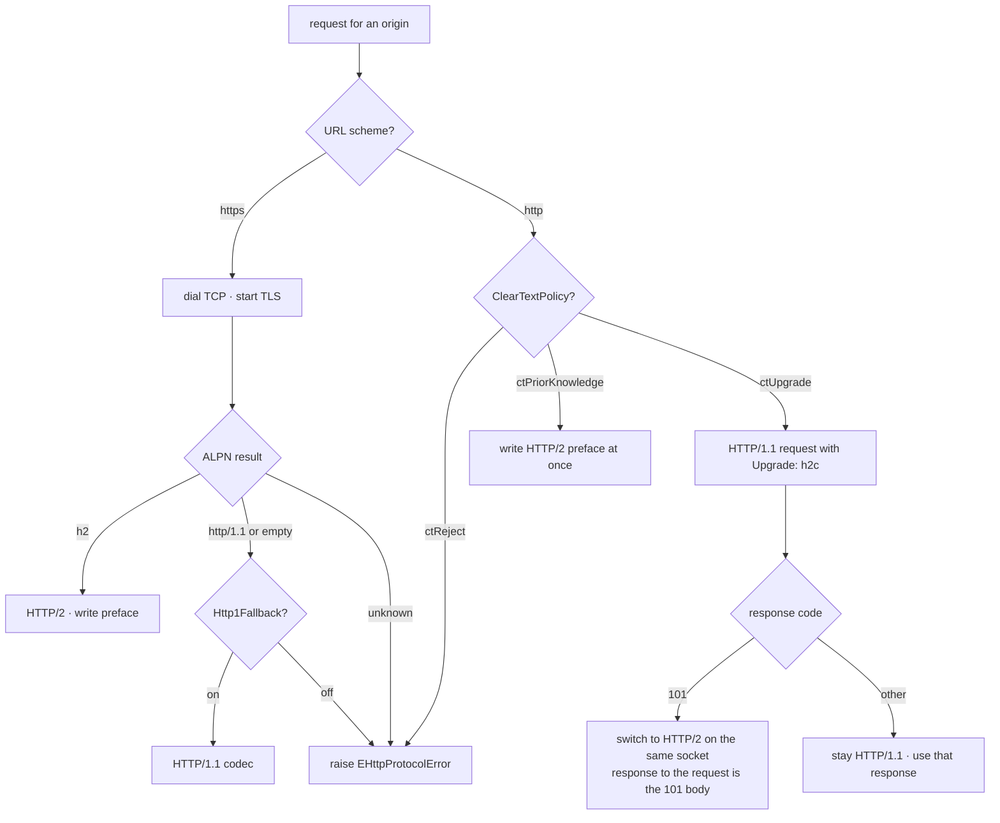

# Cleartext h2c and HTTP/1.1 Fallback

This note brings cleartext HTTP/2 (`h2c`) and HTTP/1.1 fallback into scope.
It replaces the earlier decision in [[transport]] that both are out of scope.

## Scope

The client supports four protocol modes. The client selects one mode for
each origin.

| Mode | URL scheme | Transport | How the client selects it |
| --- | --- | --- | --- |
| `h2` over TLS | `https` | TCP + TLS | ALPN selects `h2` |
| `h2c` prior knowledge | `http` | TCP, cleartext | The caller sets the policy |
| `h2c` upgrade | `http` | TCP, cleartext | The client sends an `Upgrade: h2c` request |
| HTTP/1.1 | `https` or `http` | TLS or cleartext | ALPN selects `http/1.1`, or the upgrade fails |

The default stays strict. The client uses `h2` over TLS only. Cleartext and
HTTP/1.1 fallback are off until the caller enables them. See "Factory
surface".

All four modes are implemented and covered by tests and interop cases
A.10–A.13; see "Implementation status".

## Terms

- **Origin.** The form `scheme://host:port`. The default port follows the
  scheme. The origin is the connection pool key. See [[architecture]].
- **Strict mode.** The default. The client requires `h2` over TLS.
- **Fallback.** The client accepts HTTP/1.1 when the peer does not offer
  `h2`.
- **h2c prior knowledge.** The client sends the HTTP/2 connection preface at
  once on a cleartext TCP connection. The client does no negotiation.
- **h2c upgrade.** The client sends one HTTP/1.1 request. That request
  carries an `Upgrade: h2c` header. The peer answers with `101 Switching
  Protocols`. Then both peers use HTTP/2 on the same connection.

## Negotiation

The client follows one algorithm for each request. The pool caches the
result for the origin. See [[client-api]] for lease acquisition.

### `https` origins

1. Dial TCP. Start TLS.
2. Offer the ALPN list. Use `h2` and `http/1.1` when fallback is on. Use
   `h2` alone when fallback is off.
3. Read the ALPN result.
4. If ALPN is `h2`, use HTTP/2. Write the connection preface. Continue with
   [[transport]].
5. If ALPN is `http/1.1` and fallback is on, use the HTTP/1.1 codec.
6. If ALPN is empty and fallback is on, use HTTP/1.1. RFC 7301 says that an
   empty ALPN result means HTTP/1.1.
7. If ALPN is `http/1.1` or empty and fallback is off, raise
   `EHttpProtocolError`. The message names the selected protocol. This
   matches test A.9 and story 05.4.
8. If ALPN names an unknown protocol, raise `EHttpProtocolError`.

### `http` origins

1. Dial TCP. Do not start TLS.
2. Read the cleartext policy.
3. If the policy is **reject**, raise `EHttpProtocolError`. The default
   policy is reject.
4. If the policy is **prior knowledge**, write the HTTP/2 connection
   preface. Use HTTP/2. Send no `Upgrade` header.
5. If the policy is **upgrade**, send the h2c upgrade procedure. See the
   next section.



## h2c upgrade procedure

The client does these steps one time for each connection:

1. Build the request as an HTTP/1.1 request.
2. Add the header `Upgrade: h2c`.
3. Add the header `HTTP2-Settings: <value>`. The value is the base64url
   encoding of the SETTINGS payload, with no padding. See [[protocol]].
4. Add the header `Connection: Upgrade, HTTP2-Settings`.
5. Send the request. Wait for the response.
6. If the response code is `101`, switch to HTTP/2. Write the connection
   preface. The `101` response is the response to the request.
7. If the upgrade fails, keep the HTTP/1.1 connection. Use the received
   response as the response to the request. The HTTP/1.1 codec then handles
   all later requests.

The upgrade adds one round trip. Prior knowledge does not. The client uses
prior knowledge only when the caller sets that policy.

Rule: the client must not send a later SETTINGS frame that conflicts with
the `HTTP2-Settings` value. The client must apply the `HTTP2-Settings`
value as its first SETTINGS frame.

## HTTP/1.1 codec

The HTTP/1.1 codec is small. It is not a general HTTP/1.1 client. It has
this scope:

- Request line: `METHOD SP request-target SP HTTP/1.1 CRLF`.
- Headers: one `Host` header is mandatory. Header names are
  case-insensitive on the wire.
- Header-size limit: the request head, the response head, and accumulated
  chunked trailers are each bounded by `cHttp1MaxHeaderBytes = 64 * 1024`
  (`src/Http2.Http1.pas:33`); exceeding it raises `EHttpProtocolError`
  (`ecProtocolError`).
- Body: `Content-Length` or `Transfer-Encoding: chunked`.
- Response: status line, headers, and body. The body uses
  `Content-Length`, chunked coding, or connection close.
- Connection reuse: `keep-alive` is the default in HTTP/1.1.
- The codec does not do request pipelining.

HTTP/1.1 has no multiplexing. One connection carries one request at a time.
For HTTP/1.1 origins the client sets the effective stream limit to 1. The
pool opens more connections when it needs more concurrency, bounded by
`MaxConnectionsPerHost` and `MaxTotalConnections` (doc/design/client-api.md).

The codec reuses the public surface. `IHttpClient.Send` and
`IHttpResponse` do not change. Redirects, timeouts, cancellation, and the
observer apply to HTTP/1.1 in the same way. See [[errors-redirects]] and
[[testing-observability]].

## Factory surface

The factory stays a pure value record. Each method returns a new record.
See [[client-api]].

```pascal
type
  /// how the client treats a cleartext ("http") origin
  TClearTextPolicy = (
    ctReject,           // default: raise EHttpProtocolError
    ctPriorKnowledge,   // send the HTTP/2 preface at once
    ctUpgrade           // send an HTTP/1.1 Upgrade: h2c request
  );

  THttpClientFactory = record
  private
    // ... existing fields ...
    FHttp1Fallback: Boolean;
    FClearTextPolicy: TClearTextPolicy;
  public
    // ... existing methods ...

    /// allow HTTP/1.1 when the peer does not offer h2 (https origins)
    function WithHttp1Fallback(const AEnable: Boolean): THttpClientFactory;

    /// set the policy for cleartext "http" origins
    function WithClearText(const APolicy: TClearTextPolicy): THttpClientFactory;
  end;
```

Defaults:

| Setting | Default | Meaning |
| --- | --- | --- |
| `Http1Fallback` | `False` | the client requires `h2` |
| `ClearTextPolicy` | `ctReject` | the client rejects `http` origins |

## Pool keys

The pool key is the origin, and the origin includes the scheme. The client
does not mix a TLS connection with a cleartext connection. The client does
not mix an HTTP/2 connection with an HTTP/1.1 connection. [[transport]] holds
the pool rules.

## Errors

The client uses the existing exception hierarchy. See [[errors-redirects]].

| Condition | Exception |
| --- | --- |
| Fallback is off and ALPN is not `h2` | `EHttpProtocolError` |
| Cleartext policy is `ctReject` and the scheme is `http` | `EHttpProtocolError` |
| The `101` response is malformed | `EHttpProtocolError` |
| A transport failure on a cleartext connection | `EHttpConnectionError` |
| An HTTP/1.1 parse failure | `EHttpProtocolError` |
| A response that exceeds a deadline | `EHttpTimeout` |

An HTTP/1.1 status code is not an error. The client returns it in
`IHttpResponse.StatusCode`, in the same way as HTTP/2.

## Security

Cleartext HTTP/2 and HTTP/1.1 give no confidentiality and no integrity.
Anyone on the network path can read and change the traffic.

Rules:

1. The default rejects all cleartext requests. The caller must opt in.
2. The client must log one warning for each cleartext origin. The observer
   carries this event. See [[testing-observability]].
3. The client must not send a request that carries a secret unless the
   caller set the cleartext policy on purpose.
4. The client must not fall back from `h2` to HTTP/1.1 without the caller's
   consent. A silent fallback can hide a downgrade attack.

## Implementation status

All of the above is implemented:

| Area | Where | Acceptance |
| --- | --- | --- |
| `TClearTextPolicy` + factory methods | `src/Http2.Tls.pas`, `src/Http2.Client.pas` | defaults stay strict (`ctReject`, `Http1Fallback=False`) |
| h2c prior knowledge | `src/Http2.Client.pas` (`TConnectionPool.TryH2cUpgrade` path, preface at once) | a GET against `nghttpd --no-tls` succeeds (A.10) |
| h2c upgrade | `src/Http2.Client.pas:2107` (`AcquireUpgraded`, `BuildH2cUpgradeRequest`, `Http2SettingsBase64Url`) | a GET returns `101` then uses HTTP/2 (A.11) |
| HTTP/1.1 codec | `src/Http2.Http1.pas` (`THttp1Connection`) | GET and POST against a plain HTTP/1.1 server succeed (A.12) |
| ALPN fallback | `src/Http2.Http1.pas` + transport selection in `Http2.Client` | an `http/1.1`-only TLS server responds when fallback is on |
| pool keys and limits | `TConnectionPool` selection | stream limit is 1 for HTTP/1.1; origins keep scheme apart |
| interop A.10–A.13 | `test/h2probe.pas`, `tools/validate/interop.sh` | part of the green interop gate |

The `http2/http2-test` legacy suite is draft-09 plaintext `h2c`; the prior
knowledge path gives that suite a code path to exercise.

## Validation

Four interop cases live in the probe (`test/h2probe.pas`) and
`tools/validate/interop.sh`:

| ID | Case | Pass condition |
| --- | --- | --- |
| A.10 | h2c prior knowledge | a GET against `nghttpd --no-tls` returns `200` |
| A.11 | h2c upgrade | `Upgrade: h2c` → `101`, then the response body arrives over HTTP/2 |
| A.12 | HTTP/1.1 fallback | a GET against an HTTP/1.1 server returns `200` |
| A.13 | strict mode | a cleartext request raises `EHttpProtocolError` |

Current result: `interop: PASS=13 FAIL=0 SKIP=1` → `interop gate GREEN`
(see [[validation]]).

## Open items

1. The observer needs one new event kind for a cleartext warning. The name
   is open. The security rule "log one warning for each cleartext origin"
   (below) is **not yet implemented** — `IHttp2Observer` has no cleartext
   event, so a cleartext request is currently silent. See
   [[testing-observability]] and [[open-questions]].
