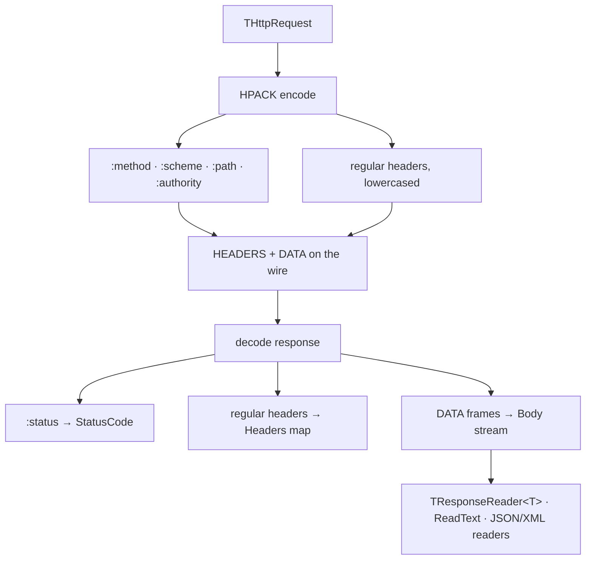

# Messages

## HttpResponse

`IHttpResponse` and `IResponseReader<T>` live in `src/Http2.Messages.pas`;
`IHttpBodyStream` lives in `src/Http2.Stream.pas` (it is wired to the
HTTP/2 lease). `Http2.Messages` exists as a separate, transport-neutral unit
so a second codec (the HTTP/1.1 fallback in `src/Http2.Http1.pas`) can
implement `IHttpResponse` without depending on `Http2.Client` — which would
be circular, since the client uses the codec to send.

```pascal
// src/Http2.Messages.pas
type
  IHttpResponse = interface
    ['{8B1C2D3E-4F50-4A61-9C72-0123456789AB}']
    function GetStatusCode: LongInt;
    function GetHeaders: IHttpHeaders;
    function GetBody: IHttpBodyStream;
    property StatusCode: LongInt read GetStatusCode;
    property Headers: IHttpHeaders read GetHeaders;
    property Body: IHttpBodyStream read GetBody;
  end;

// src/Http2.Stream.pas
type
  IHttpBodyStream = interface
    /// block until bytes are available or END_STREAM. The first Read that
    /// observes EOF returns 0; a Read after EOF raises EHttpStreamError.
    function Read(var ABuffer; const ACount: LongInt): LongInt;
    /// true once END_STREAM (or a bodyless response) is observed and any
    /// buffered bytes are exhausted
    function Eof: Boolean;
  end;
```

`Http2.Messages` also re-exports `TClearTextPolicy`, `TNegotiatedProtocol`,
and `ICleartextSocketFactory` as aliases of the types declared in
`Http2.Tls` (they cannot live here, or `Http2.Tls` would need this unit
while this unit needs `Http2.Tls` for `IHttp2Socket`).

The generic read helper (see the syntax note below) maps a response body to
a `T`:

```pascal
// src/Http2.Messages.pas
{$mode delphi}
type
  IResponseReader<T> = interface
    function Read(const AResponse: IHttpResponse): T;
  end;

// src/Http2.Client.pas
type
  TResponseReader<T> = class(TInterfacedObject, IResponseReader<T>)
  public
    function Read(const AResponse: IHttpResponse): T; overload;
    class procedure Read(const AResponse: IHttpResponse;
      out AValue: T); overload; static;
  end;
```

The implementation pulls from `AResponse.Body` until Eof or enough bytes
for `T`, then decodes: a `tkAString` type (which includes `UTF8String` on
FPC 3.2.4) is decoded as an `AnsiString` **without conversion**, a
dynamic-array type is read as `TBytes`, and any other type is `memcpy`'d
from `SizeOf(T)` bytes. A malformed or short body raises
`EHttpProtocolError` here, not in `Send`.

Usage — both forms exist, so pick the one that fits:

```pascal
var
  Dto: TMyDto;
begin
  Response := Client.Send(Request);
  // instance form (interface-compatible, dependency-injectable):
  Dto := TResponseReader<TMyDto>.Create.Read(Response);
  // static form (no temporary object):
  TResponseReader<TMyDto>.Read(Response, Dto);
end;
```

**Syntax note (verified).** The original
`Read( reader: ResponseReader<T>, <T> value)` was pseudo-syntax. FPC 3.2.4
**cannot parse a generic method under `{$mode objfpc}`** — the probe
`probe.pas` fails with `Syntax error, ";" expected but "<" found`, and
adding `{$modeswitch genericmethods}` (`probe10.pas`) does not help. Under
`{$mode delphi}` a generic method *does* compile (`probe9.pas`: generic
`class procedure Foo<T>` called as `TUtil.Foo<Integer>`). The design
therefore uses **`{$mode delphi}`** and puts the generic on a **class**
(`TResponseReader<T>`) so it also works as a specialized class when a
method-level generic is undesirable. `IResponseReader<T>` remains the
interface form for dependency injection. See [[fpc-runtime]] for the full
verified-facts table.

- `StatusCode` is the HTTP/2 `:status` pseudo-header (exactly one required
  on a response).
- Pseudo-headers are **not** exposed in the public `Headers` map; they are
  surfaced through typed properties (`StatusCode`, etc.).
- **Body consumption:** the body is a stream. `Read` blocks until enough
  DATA bytes are available or `END_STREAM` is seen. A second read after EOF
  raises deterministically rather than hanging.
- The response object stays valid after `Send` returns even while other
  threads use the client.

## HttpRequest

```pascal
type
  THttpMethod = (hmGet, hmHead, hmPost, hmPut, hmDelete, hmConnect,
    hmOptions, hmTrace, hmPatch);

  IBodyWriter = interface
    function NextChunk(out ABuffer: TBytes): Boolean;
  end;

  THttpBody = record
  private
    FData: TBytes;
    FIsSet: Boolean;
  public
    class function FromBytes(const AData: TBytes): THttpBody; static;
    class function FromString(const AData: string): THttpBody; static;
    function IsSet: Boolean;
    function Data: TBytes;
  end;

  THttpRequest = record
  private
    FMethod: THttpMethod;
    FMethodOverride: string;   // extension verbs, uppercase token
    FUrl: string;
    FHeaders: IHttpHeaders;
    FBody: THttpBody;
    FBodyWriter: IBodyWriter;
  public
    class function Create(const AMethod: THttpMethod;
      const AUrl: string): THttpRequest; static;
    function WithMethod(const AMethod: THttpMethod): THttpRequest;
    function WithMethodToken(const AToken: string): THttpRequest;  // escape hatch
    function WithHeader(const AName, AValue: string): THttpRequest;
    function WithAcceptEncoding(const AValue: string): THttpRequest;
    function WithBody(const ABody: THttpBody): THttpRequest;
    function WithBodyWriter(const AWriter: IBodyWriter): THttpRequest;
    function Url: string;
    function Method: THttpMethod;
    function Headers: IHttpHeaders;
    function Body: THttpBody;
    function BodyWriter: IBodyWriter;
  end;
```

- `WithMethodToken` is the escape hatch for extension verbs. The token is
  validated and **uppercased** before it reaches HPACK; a lowercase method
  on the wire is a protocol error.
- `FBody` and `FBodyWriter` are mutually exclusive: `FBodyWriter` wins and
  `FBody.IsSet=False` is required; setting both raises.
- `FHeaders` is an interface, so copying a `THttpRequest` shares the header
  map. This is deliberate shared behaviour, not a hidden copy
  ([[messages]]).
- Pseudo-header mapping happens at encode time (`THttpRequest.ToStreamRequest`):
  `:method` ← method token, `:scheme` ← the URL scheme (`'http'` or
  `'https'`), `:path` ← path+query (`'/'` when empty), `:authority` ←
  `host[:port]` (port omitted when the scheme default). Regular headers
  follow, all names lowercased. The scheme also drives transport selection
  (TLS vs cleartext, and the cleartext policy) — see [[fallback]].
- `AddPseudo` is how the codec carries the pseudo-headers without them
  entering the public `Headers` map; `GetPseudo` reads one back. A caller
  cannot inject a pseudo-header into `Headers` by accident.
- A `FBodyWriter` body is single-use / non-replayable (see
  [[errors-redirects]]).

## Headers and header names

`IHttpHeaders` is a map of `string` → list of `string`:

```pascal
// src/Http2.Headers.pas
type
  IHttpHeaders = interface
    procedure Add(const AName, AValue: string);
    procedure SetValue(const AName, AValue: string);
    function GetValues(const AName: string): TArray<string>;
    function GetFirst(const AName: string): string;
    function Contains(const AName: string): Boolean;
    procedure Remove(const AName: string);
    function Names: TArray<string>;
    /// carry a pseudo-header (name starts with ':') without entering the map
    procedure AddPseudo(const AName, AValue: string);
    /// read a pseudo-header set via AddPseudo, or '' when absent
    function GetPseudo(const AName: string): string;
  end;
```

Implementation (`THttpHeaders`) uses `TDictionary<string, TStringList>` for
regular headers plus a separate `TDictionary<string, string>` for
pseudo-headers, inside a `TInterfacedObject`. Header names are normalized to
lowercase on `Add`/`SetValue`; values are preserved verbatim. Adding a
connection-specific header is rejected: `ForbiddenHeaders` is
`connection`, `keep-alive`, `transfer-encoding`, `upgrade`,
`proxy-connection`. The one RFC-defined exception is `te`, which HTTP/2
permits (RFC 9113 section 8.2.2); a **response** may carry it only with the
value `trailers`, and any other value raises `EHttpStreamError` with
`ecProtocolError` while the response headers are decoded
(`TStreamLease.HandleInboundFrame` in `src/Http2.Stream.pas`).

Header names are a set of constants of common HTTP header names:

```pascal
const
  // Pseudo-headers (never mixed into the regular map).
  HeaderMethod    = ':method';
  HeaderPath      = ':path';
  HeaderScheme    = ':scheme';
  HeaderAuthority = ':authority';
  HeaderStatus    = ':status';

  // Regular headers, lowercase (HTTP/2 wire form).
  HeaderContentType   = 'content-type';
  HeaderContentLength = 'content-length';
  HeaderContentEncoding = 'content-encoding';
  HeaderAccept        = 'accept';
  HeaderAcceptEncoding = 'accept-encoding';
  HeaderUserAgent     = 'user-agent';
  HeaderAuthorization = 'authorization';
  HeaderCookie        = 'cookie';
  HeaderSetCookie     = 'set-cookie';
  HeaderCacheControl  = 'cache-control';
  HeaderLocation      = 'location';
  HeaderHost          = 'host';
  HeaderTe            = 'te';
```

Do not include connection-specific headers (`connection`, `keep-alive`,
`transfer-encoding`) — they are forbidden in HTTP/2.



## Request and response streaming

- **Request:** a `THttpBody` is sent in one or more `ftData` frames; an
  `IBodyWriter` is pulled by the connection thread until
  `NextChunk` returns `False`, then `END_STREAM` is set on the last DATA
  frame (or on `HEADERS` when there is no body). A writer body is single-use
  and non-replayable.
- **Response:** `Send` returns after HEADERS. The caller reads `Body` until
  `Eof`. `END_STREAM` (or a bodyless `HEADERS`) ends the body;
  `ftRstStream` mid-body surfaces from `Read`, not from the already-returned
  `Send`.
- `HEAD` responses and `204`/`304` have no body by definition; `Body.Eof` is
  immediately `True`.
- Buffered vs. streamed is an explicit choice of reader: a buffering
  `IResponseReader<T>` reads to EOF then decodes; an incremental one decodes
  per chunk.

## Content coding

`src/Http2.Encoding.pas` holds the content codings the client understands:
gzip (RFC 1952) and deflate (RFC 1950, or a bare deflate stream). The codecs
use the zlib bindings that Free Pascal ships with the compiler
(`paszlib`/`zstream`), so the unit adds no dependency.

The client offers no coding by default. A caller opts in with
`THttpRequest.WithAcceptEncoding('gzip, deflate')`, which sets the
`accept-encoding` header. When the response names a coding the client
understands, the body is decoded transparently: the response is wrapped so
that `Body` yields plain bytes, and the `content-encoding` header (with a
`content-length` that no longer counts) is removed. Every reader therefore
sees plain bytes, whether it is `ReadText`, `ReadAllBodyBytes`, or a typed
reader.

`ReadText` only copies bytes verbatim; the decode happens below it, in the
body stream, so it needs no special case.

Two problems in the field shape the code:

- A server may send a bare deflate stream under the name `deflate`. The
decoder detects the container from the first two bytes (RFC 1950 section
2.2) and falls back to a bare stream when the header is absent.
- A response body is not seekable, so the gzip decoder cannot seek to the
footer to check the CRC. FPC's `TGZipDecompressionStream` skips that check
when the seek fails, which is what the body adapter arranges.

## Text, JSON, and XML helpers

Three convenience layers sit on top of the streaming API. They exist so the
common "send a small body / read the whole body" case does not need a
hand-rolled loop.

**Base library (`Http2.Client`).**

- `WithTextBody(ARequest, AText): THttpRequest` copies `AText` into the
  request body **byte for byte** and sets `content-type: text/plain` when no
  content-type is already present. It never overwrites an explicit
  content-type.
- `ReadText(AResponse): string` drains the response body to EOF and copies
  the bytes **verbatim** — no charset sniffing, no transcoding. It is the
  string counterpart of reading the raw `TBytes`.
- `TResponseReader<T>` (see above) keeps its raw-passthrough semantics: a
  `tkAString` type (which includes `UTF8String` on FPC 3.2.4) is decoded as
  an `AnsiString` without conversion, a `tkDynArray` is read as `TBytes`, and
  anything else is `memcpy`'d as `SizeOf(T)`. A reader that wants
  interpretation must do it itself.

**Optional readers (`Http2.Readers`).**

This unit is *outside* the 13-unit core. It is the only unit with an
`fcl-json`/`fcl-xml` dependency, so it is linked only when a caller names it
in their `uses` clause.

| Helper | Returns | Notes |
|---|---|---|
| `TJsonObjectReader` / `ReadJsonObject` | `TJSONObject` | rejects a non-object body |
| `TJsonReader<T: TJSONData>` / `ReadJsonData` | `T` | any `TJSONData` descendant |
| `TXmlDocumentReader` / `ReadXmlDocument` | `TXMLDocument` | accepts `us-ascii` declarations |

- Every `Read` helper consumes the whole body to EOF.
- The returned object is **caller-owned**; the helper never caches or frees
  it.
- A body that does not parse raises `EHttpProtocolError`
  (`ecProtocolError`); the underlying `EJSONParser` / `EXMLReadError` is
  caught and re-raised, never leaked.
- The class forms expose a `Parse(const AText: string)` static function and a
  `Read(const AResponse)` instance method, so the same reader works on a
  string payload in a test or on a live response.
- `TXmlDocumentReader` rewrites an `encoding="us-ascii"` (or `"ascii"`)
  declaration to `utf-8` before parsing. `fcl-xml` rejects `us-ascii`, and
  US-ASCII is a strict subset of UTF-8, so the rewrite is byte-safe. No other
  declared encoding is touched, so `iso-8859-1` high bytes survive unchanged.

**Send helpers (`Http2.Readers`).** These are pure request builders and never
touch the network:

- `WithJsonBody(ARequest, AData: TJSONData)` serializes `AData` (via
  `AsJSON`) and defaults `content-type: application/json`.
- `WithJsonText(ARequest, AJson)` attaches the string verbatim and applies
  the same content-type default.
- `WithXmlBody(ARequest, ADoc: TXMLDocument)` serializes the document and
  defaults `content-type: application/xml`.

Each respects an explicitly set content-type.
