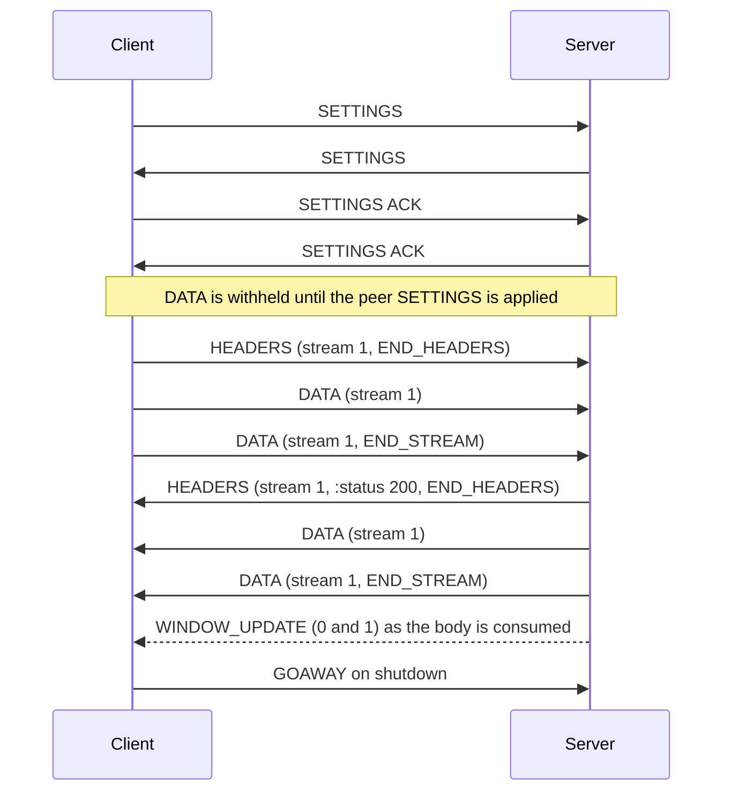
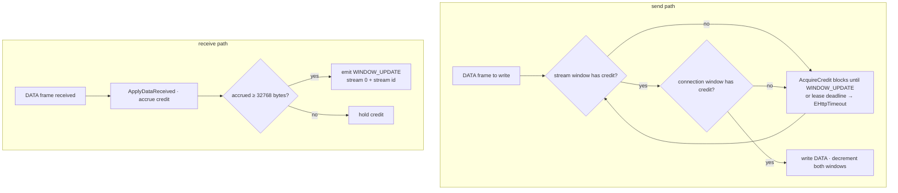

# Protocol Layer

## Frame layer

```pascal
type
  TFrameType = (
    ftData           = $0,
    ftHeaders        = $1,
    ftPriority       = $2,
    ftRstStream      = $3,
    ftSettings       = $4,
    ftPushPromise    = $5,
    ftPing           = $6,
    ftGoAway         = $7,
    ftWindowUpdate   = $8,
    ftContinuation   = $9);

  // wire bit values collide across frame types: PADDED=$8, PRIORITY=$20,
  // END_STREAM=ACK=$1, END_HEADERS=$4
  TFrameFlags = set of (ffEndStream, ffEndHeaders, ffAck, ffPadded, ffPriority);

  TFrameHeader = record
    Length: LongWord;      // 24 bits on the wire
    FrameType: TFrameType;
    Flags: TFrameFlags;
    StreamId: LongWord;    // reserved bit masked off
    procedure Clear;
    procedure WriteTo(const ABuffer: TBytes);          // serialize 9 bytes
    class function ReadFrom(const ABuffer: TBytes): TFrameHeader; static;
  end;

  TFrame = record
    Header: TFrameHeader;
    Payload: TBytes;
    class function Create(const AFrameType: TFrameType; const AFlags: TFrameFlags;
      const AStreamId: LongWord; const APayload: TBytes): TFrame; static;
    function DataLength: LongWord;      // payload length
    function IsEndStream: Boolean;
    function IsEndHeaders: Boolean;
    function IsAck: Boolean;
    function IsPadded: Boolean;
    function IsPriority: Boolean;       // HEADERS-only: 5-byte PRIORITY block
  end;

  TConnectionSettings = record
    HeaderTableSize: LongWord;
    EnablePush: Boolean;
    MaxConcurrentStreams: LongWord;   // $7FFFFFFF = "unlimited"
    InitialWindowSize: LongWord;
    MaxFrameSize: LongWord;
    MaxHeaderListSize: LongWord;
  end;
```

Which frames the client sends vs. receives, and how they map to the public
API:

| Frame | Client sends | Client receives | Maps to |
| --- | --- | --- | --- |
| `ftSettings` | yes (preface, acks) | yes | connection setup/limits |
| `ftHeaders` | yes | yes | request headers / response `:status` |
| `ftContinuation` | yes | yes | continuation of a header block |
| `ftData` | yes | yes | request body / response body |
| `ftWindowUpdate` | yes | yes | flow control |
| `ftRstStream` | yes | yes | cancellation / stream error |
| `ftGoAway` | yes (shutdown) | yes | connection drain |
| `ftPing` | yes | yes | keep-alive / RTT |
| `ftPriority` | **no** (never sent) | yes (parsed, not scheduled on) | prioritization — ignored |
| `ftPushPromise` | n/a | yes (ignored; push is disabled) | server push |

`Send` returning "status + headers" is exactly `ftHeaders` with
`ffEndHeaders` decoded and `:status` present. See [[messages]].



## HPACK

Header compression is **connection-scoped and stateful**, which is why the
codec lives on `TConnection` (see [[transport]]):

```pascal
type
  THpackCodec = class
  private
    FEncoder: THpackTableState;   // dynamic table, write side
    FDecoder: THpackTableState;   // dynamic table, read side
    FMaxTableSize: LongWord;
    FHuffman: Boolean;            // default True
  public
    function Encode(const AHeaders: THeaderBlock): TBytes;
    function Decode(const AData: TBytes): THeaderBlock;
    procedure ApplySettings(aMaxTableSize: LongWord);

    property EncoderTableSize: LongWord;   // bytes used, encoder table
    property DecoderTableSize: LongWord;   // bytes used, decoder table
    property EncoderMaxSize: LongWord;     // current encoder cap
    property DecoderMaxSize: LongWord;     // current decoder cap
    property Huffman: Boolean;             // encode string literals as Huffman
  end;
```

A malformed block raises `EHttpProtocolError` (`ecCompressionError`).

- **Static table** — fixed, known to both peers.
- **Dynamic table** — grows/shrinks as fields are sent/received; encoder and
  decoder must apply identical eviction rules and honor
  `SETTINGS_HEADER_TABLE_SIZE`.
- Correctness requires exact ordering: the decoder processes header blocks
  in the order the connection thread read them; the encoder emits blocks in
  the order streams were written. A missed/reordered block desynchronizes
  every subsequent decode on that connection.
- Errors (`COMPRESSION_ERROR`) are **connection-fatal** and force `GOAWAY`,
  not a single-stream failure.

## Flow control

`src/Http2.FlowControl.pas` holds two types: `TWindow` (one window's
arithmetic) and `TFlowControl` (the connection-level aggregate — the shared
connection window plus one `TWindow` per open stream), plus the pure
batching predicate `ShouldEmitWindowUpdate`:

```pascal
type
  TWindow = record
  private
    FSize: Int64;      // signed: the send window may go negative
    FConsumed: Int64;  // receive credit accrued since the last WINDOW_UPDATE
  public
    class function Defaults(const AInitial: LongInt): TWindow; static;
    function Size: Int64;
    function Consumed: Int64;
    function CanSend: Boolean;
    function CanSendN(const AN: LongWord): Boolean;
    function TryConsume(const AN: LongWord): Boolean;   // fails without mutating
    procedure ApplyUpdate(const AIncrement: LongWord);
    procedure ApplyDataSent(const AN: LongWord);
    procedure ApplyDataReceived(const AN: LongWord);
    procedure ApplyInitialWindowDelta(const ADelta: Int64);
    function NeedsUpdate(const AThreshold: LongInt): Boolean;
    function UpdateIncrement: LongWord;
  end;
```

`ApplyUpdate` treats a zero increment as `ecProtocolError` and an overflow
past 2^31-1 as `ecFlowControlError`; `TryConsume` is the send-side guard
that leaves the window untouched on failure.

`TFlowControl` wraps the pair so a blocked stream never drains the shared
connection window:

```pascal
type
  TFlowControl = class
  public
    constructor Create(const AConnectionWindow, AInitialStreamWindow: LongInt);
    procedure OpenStream(const AStreamId: LongWord);
    procedure CloseStream(const AStreamId: LongWord);
    function TryGetStream(const AStreamId: LongWord; out AWindow: TWindow): Boolean;
    /// decrement both windows for AN DATA bytes; False (nothing changed) when
    /// either lacks credit
    function TryConsume(const AStreamId: LongWord; const AN: LongWord): Boolean;
    procedure ApplyConnectionUpdate(const AIncrement: LongWord);
    procedure ApplyStreamUpdate(const AStreamId: LongWord;
      const AIncrement: LongWord);
    /// apply a SETTINGS_INITIAL_WINDOW_SIZE delta to every open stream and
    /// to the initial size used for streams opened later
    procedure ApplyInitialWindowDelta(const ADelta: Int64);
    property Connection: TWindow read FConnection;
    property InitialStreamWindow: LongInt read FInitialStreamWindow;
  end;
```

`TConnection` drives `TFlowControl` (`TrackReceivedData`, `SendWindowUpdate`,
`ApplyPeerSettingsValue`); see the implementation note below.

Two nested windows, both counting **only** DATA bytes:

- **Connection-level window** — shared by all streams.
- **Stream-level window** — per stream, initialized from
  `SETTINGS_INITIAL_WINDOW_SIZE`.

Rules:

- Sending DATA decrements both windows; the sender must not exceed either and
  waits for `WINDOW_UPDATE`. This turns a slow reader into backpressure on
  `IBodyWriter` rather than unbounded buffering.
- Receiving DATA consumes local windows; the client sends `WINDOW_UPDATE`
  (connection and stream) as `Read` consumes bytes, so a slow consumer
  throttles the peer.
- `WINDOW_UPDATE` is batched: credit is returned once
  `TWindow.NeedsUpdate(Threshold)` is true, so small reads do not emit one
  frame per call.



### Implementation note (S12 validation finding)

`TFlowControl` was implemented and unit-tested but initially wired into
**nothing** — `TWindow` existed but returned no credit: `TConnection`
received DATA without ever returning window

credit, so a body larger than the advertised 65535-byte window stalled once
the peer's window hit zero — nghttpd simply stopped sending and the read
raised `EHttpTimeout` (`timed out reading response body`). Interop case A.7
(a 100 000-byte response) reproduces it.

The connection layer now drives `TFlowControl`: `TrackReceivedData` accrues
receive credit on every inbound DATA frame, and `SendWindowUpdate` posts a
WINDOW_UPDATE — connection level on stream 0, stream level on the lease's
stream — once `cWindowUpdateBatchSize` (32768) bytes have accrued;
`UnregisterStream` flushes the remainder. `ApplyPeerSettingsValue` adjusts
every open stream by the `SETTINGS_INITIAL_WINDOW_SIZE` delta.
