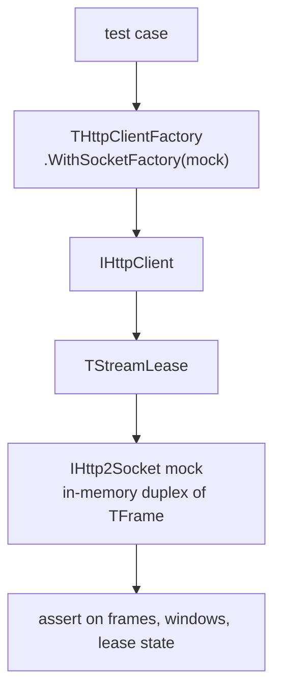
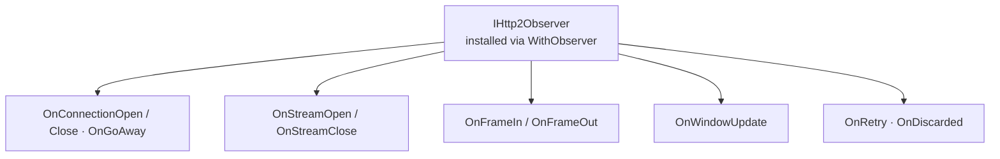

# Testing & Observability

## Test seams

The suite exercises real behaviour without a network by substituting the
transport:

- **`IHttp2Socket` mock** — `test/Http2.MockSocket.pas` is an in-memory
duplex of `TFrame`s. The whole connection loop, HPACK, flow control, and
the lease state machine run against it.
- **`IHttp2SocketFactory`** — the factory's `WithSocketFactory` installs a
  custom transport, which is how the mock is injected in tests and how a
  caller could supply their own TLS stack.
- **Pure layers** — `THpackCodec`, `TWindow`, `TFrame`/`TFrameHeader`
  serialization, and the header codec are pure enough to test in isolation.
- **`TResponseReader<T>`** — the base reader plus the optional
  `Http2.Readers` JSON/XML readers are tested directly against an
  `IHttpResponse` built from a string.



## Test suite layout

The fpcunit console runner is `test/Http2.TestRunner.pas`; the entry point
is `test/Http2.RunTests.pas`. One test unit per source area:

| Test unit | Area |
|---|---|
| `Http2.Errors.Test` | exception hierarchy and error codes |
| `Http2.Frames.Test` | frame header/payload round-trips |
| `Http2.Headers.Test` | header collection and constants |
| `Http2.Hpack.Test` / `Http2.HpackProps.Test` | HPACK codec + property tests |
| `Http2.FlowControl.Test` | `TWindow` arithmetic |
| `Http2.Tls.Test` | ALPN, policy, certificate checks |
| `Http2.BlockingQueue.Test` | bounded blocking queue |
| `Http2.ConnectionThread.Test` | per-connection thread loop |
| `Http2.ConnectionLifecycle.Test` | create/drain/GOAWAY/close |
| `Http2.Stream.Test` | stream state machine + `THttpBody` |
| `Http2.Client.Test` | client surface, readers, text helpers |
| `Http2.Request.Test` | `THttpRequest` construction |
| `Http2.Redirects.Test` | 3xx rewriting and bounds |
| `Http2.Timeouts.Test` | connect/header/idle deadlines |
| `Http2.Readers.Test` | JSON/XML readers and send helpers |
| `Http2.Concurrency.Test` | caps and backpressure under load |
| `Http2.ProbeOutcome.Test` | `TProbeOutcome` classification |
| `Http2.ClearText.Test` / `Http2.Http1.Test` | h2c and HTTP/1.1 fallback |

Property-style checks (HPACK `Decode(Encode(H)) = H`, window arithmetic,
frame serialization) run alongside the example-based cases. Run with
`make test` or `task test`; the runner exits non-zero on any failure.

## Observability hooks

`IHttp2Observer` (in `src/Http2.Observer.pas`) is installed with
`THttpClientFactory.WithObserver`:

```pascal
type
  IHttp2Observer = interface
    procedure OnConnectionOpen;
    procedure OnConnectionClose(const AMessage: string;
      const ACode: THttp2ErrorCode);
    procedure OnGoAway(const ALastStreamId: LongWord;
      const ACode: THttp2ErrorCode);
    procedure OnStreamOpen(const AStreamId: LongWord);
    procedure OnStreamClose(const AStreamId: LongWord);
    procedure OnFrameIn(const AFrame: TFrame);
    procedure OnFrameOut(const AFrame: TFrame);
    procedure OnWindowUpdate(const AStreamId: LongWord;
      const AIncrement: LongWord);
    procedure OnRetry(const AStreamId: LongWord);
    procedure OnDiscarded(const AFrame: TFrame; const AReason: string);
  end;
```



An observer is passive and must not block: callbacks fire on the connection
thread. Observers are attached per connection as it is opened, so a single
observer instance sees every connection the client creates.

## Concurrency tests

`Http2.Concurrency.Test` drives many threads calling `Send` against a slow
streaming mock to prove:

- the per-host (`MaxConnectionsPerHost`) and pool-wide
  (`MaxTotalConnections`) connection caps hold under contention;
- `MaxStreamsPerConnection` and the peer's
  `SETTINGS_MAX_CONCURRENT_STREAMS` bound concurrent requests;
- backpressure throttles the caller instead of buffering without limit.
