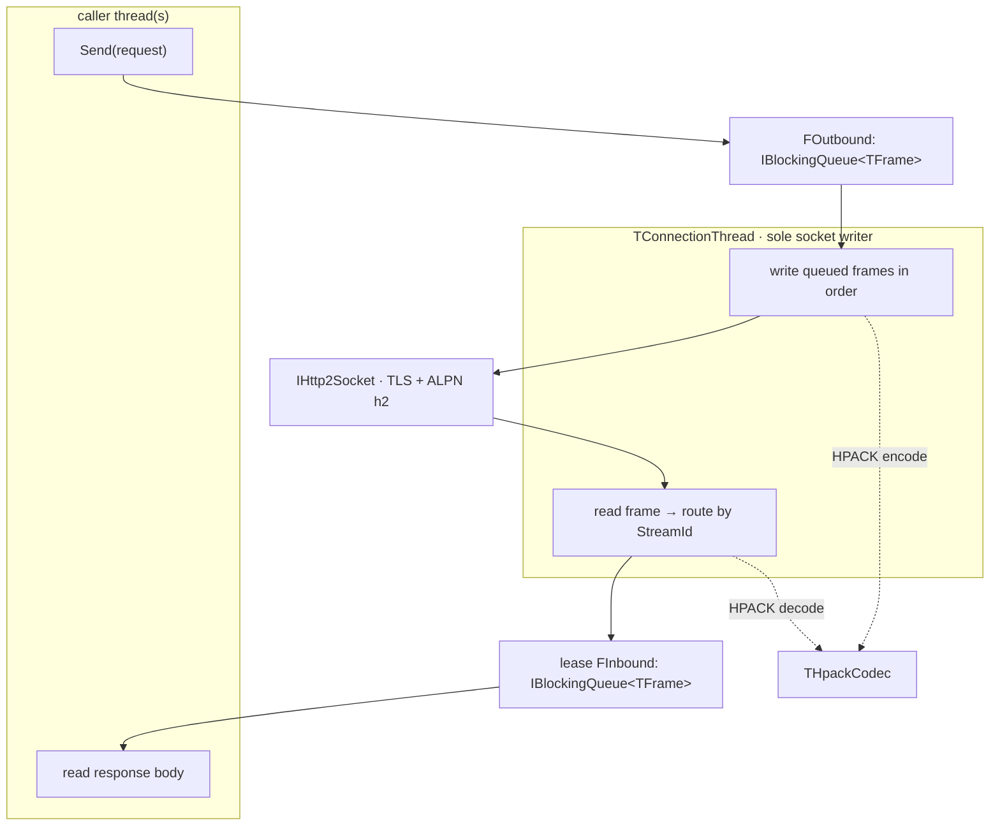
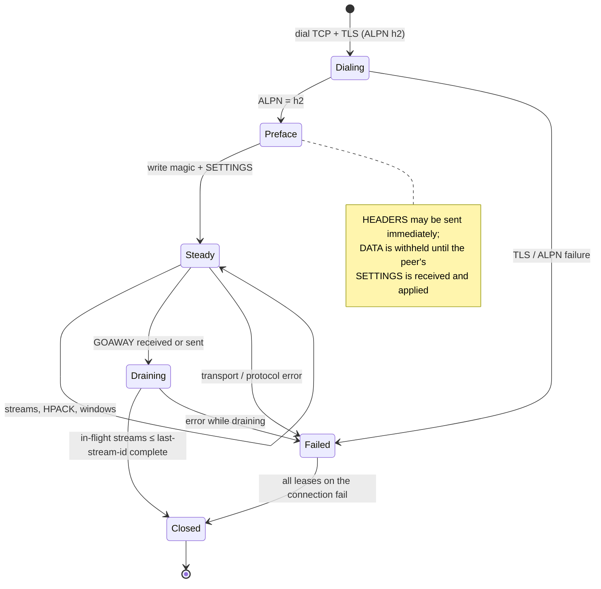

# Transport, Threads & Connection Lifecycle

## Threading and queues

Free Pascal 3.2.4 primitives (all choices below are probe-verified; see
[[fpc-runtime]]):

- `TThread` (unit `Classes`) — one subclass per connection,
  `TConnectionThread`.
- **`TBlockingQueue<T>` — the outbound and inbound frame queues.** FPC 3.2.4
  has **no `TThreadedQueue<T>`** (`Identifier not found "TThreadedQueue"`),
  so the design defines its own bounded, blocking queue from
  `TQueue<T>` (unit `Generics.Collections`), a `TCriticalSection`, and two
  `RTLEvent`s. `probe12.pas` compiles and runs it (a consumer thread drains
  100 items; sum = 5050), including a `Shutdown` that releases blocked
  waiters. **It must be saved and restored as an interface**
  (`IBlockingQueue<T>`) so a thread and a caller can share one queue by
  refcount rather than by raw pointer.
- `TCriticalSection` (unit `SyncObjs`) — the pool guard, and per-connection
  stream-id allocation even though the object is free-threaded
  (`TMonitor` is **not** in FPC 3.2.4; `Identifier not found "TMonitor"`).
- `RTLEvent` (unit `Classes`) — slot signalling and queue wakeups.
  **Use `RTLEvent`, not `TEvent`/`TSimpleEvent`**: on macOS both constructs
  raise `ESyncObjectException: Failed to create OS basic event` (probe6,
  probe11), while `RTLEventCreate`/`RTLEventSetEvent`/`RTLEventWaitFor`
  works (probe7).
- `{$IFDEF UNIX}cthreads,{$ENDIF}` must precede threaded units in any
  program's `uses`; otherwise: `This binary has no thread support compiled
  in ... Runtime error 232` (probe12 first run).

```pascal
{$mode delphi}
type
  IBlockingQueue<T> = interface
    procedure Push(const AItem: T);
    function Pop(out AItem: T): Boolean;   // False on shutdown + empty
    procedure Shutdown;                    // releases blocked waiters
  end;

  TBlockingQueue<T> = class(TInterfacedObject, IBlockingQueue<T>)
  private
    FLock: TCriticalSection;
    FNotEmpty: PRTLEvent;
    FNotFull: PRTLEvent;
    FItems: TQueue<T>;
    FCapacity: Integer;
    FShutdown: Boolean;
  public
    constructor Create(const ACapacity: Integer = 128);
    destructor Destroy; override;
    procedure Push(const AItem: T);
    function Pop(out AItem: T): Boolean;
    procedure Shutdown;
  end;

  TConnectionThread = class(TThread)
  private
    FConn: Pointer;             // weak ref to TConnection (no AddRef)
    FOutbound: IBlockingQueue<TFrame>;
    FInbound: IBlockingQueue<TFrame>;
    FSocket: IHttp2Socket;
  protected
    procedure Execute; override;
  public
    constructor Create(AConn: TConnection);   // does NOT retain AConn
  end;
```

One thread per connection, responsible for *both* directions:

- **Outbound:** a `Send`/`Read` caller never writes to the socket. It pushes
  frames onto `FOutbound` and returns (or blocks on `FInbound`). The
  connection thread writes them in queue order.
- **Inbound:** the thread reads frames and, keyed by `StreamId`, pushes them
  onto that lease's `FInbound`. Frames for unknown/closed streams (late DATA
  after `RST_STREAM`) are discarded and counted.
- **Ordering:** frames for one stream are written in enqueue order;
  `HEADERS`/`CONTINUATION` must be contiguous and `DATA` must follow its
  `HEADERS`. The single writer guarantees this by construction.
- **Backpressure:** `TBlockingQueue` has a bounded depth; a full outbound
  queue blocks (or returns a retryable error) instead of growing unbounded.
  A full inbound queue applies flow-control pressure via window updates. On
  shutdown, `Shutdown` unblocks waiters and pending calls fail with
  `EHttpConnectionClosed` rather than hanging.
- **Contention:** the HPACK encoder is stateful and shared across streams.
  Encoding is therefore routed through the connection thread (or guarded by
  the connection's critical section); the decoder is touched only by the
  connection thread.
- **ARC hazard:** `TConnectionThread` stores a raw (weak) pointer to avoid
  an interface reference cycle (`TConnection` ↔ thread). `TConnection`
  `Terminate`+`WaitFor`s the thread before releasing `FSocket`/queues.
  The queues themselves are interfaces, so both sides can hold one without
  a raw-pointer lifetime bug.



## Connection lifecycle

1. **Create.** Dial TCP, then TLS negotiating ALPN `h2`. On negotiated `h2`,
   write the connection preface: the client magic
   `PRI * HTTP/2.0` + CRLF + CRLF + `SM` + CRLF + CRLF, then a `SETTINGS`
   frame. The connection can open streams as soon as the preface is written:
   a request may send `HEADERS` immediately, since HEADERS is not
   flow-controlled. `DATA`, however, is withheld until the peer's `SETTINGS`
   is received and applied, because only then is
   `SETTINGS_INITIAL_WINDOW_SIZE` known — the default is 65535, but a peer
   may lower it, and emitting DATA first would overrun its window
   (RFC 9113 section 6.5.3: `FLOW_CONTROL_ERROR`).
2. **Steady state.** Serve streams; maintain HPACK tables, settings, and
   windows.
3. **Keep-alive.** Idle connections may be probed with `PING` and closed
   after `FIdleTimeoutMs`, provided no active streams.
4. **`GOAWAY`.** Mark draining; stop creating new streams. Streams with ids
   at or below the last-stream-id may complete; **higher streams may be
   safely retried on a fresh connection (the peer guarantees it did not
   process them).** Never retry a stream that may have been processed unless
   the request is known to be safe. Remove an unusable connection from the
   pool and open a replacement.
5. **Errors.** A transport/protocol error fails all leases on that
   connection; `ftRstStream` fails only the affected lease.
6. **Shutdown.** `IHttpClient.Close` stops accepting leases, drains or
   cancels in-flight streams, sends `GOAWAY` where possible, stops every
   `TConnectionThread` (`Terminate`+`WaitFor`), and closes sockets.
   Idempotent.



`GOAWAY` semantics: streams with ids **above** the last-stream-id were never
processed by the peer, so they may be retried on a fresh connection; streams
at or below it may have been processed and are only retried if the method is
known safe.

**Reconnect policy**: transparent retry on connection failure only for
idempotent methods (no body writer), and only on `ecRefusedStream` or a
`GOAWAY` that puts the stream above the last-stream-id; bounded by
`cMaxTransparentRetries`. There is no per-request opt-in. See [[transport]].

## TLS and ALPN

- The default is TLS only. The client uses `https` origins with ALPN `h2`.
- ALPN must offer `h2`. If the server does not select `h2`, the client
  raises `EHttpProtocolError` by default. It does not fall back to HTTP/1.1
  without the caller's consent. `NPN` is not required.
- **In scope since 2026-10-06:** cleartext `h2c` (prior knowledge and
  upgrade) and HTTP/1.1 fallback. Both are available when the caller enables
  them. The default stays strict. See [[fallback]].
- Certificate validation/trust configuration is a factory concern (hostname
  verification on by default).
- Proxy: with `WithProxy`, negotiate TLS/`h2` over a caller-supplied
  forward proxy via an HTTP `CONNECT` tunnel to the origin. The TCP
  connection goes to the proxy; the `CONNECT` is negotiated on the plain
  socket before TLS, so SNI, certificate verification and ALPN still target
  the origin host and the h2c/HTTP/1.1 paths tunnel identically. A non-2xx
  `CONNECT` response raises `EHttpConnectionError` (`proxy CONNECT failed`);
  the client never silently falls back to a direct connection.
