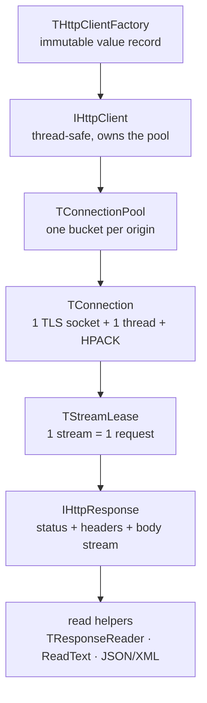

# HTTP/2 Client

Design an Object Pascal HTTP/2 client.

Target: **Free Pascal 3.2.4** (`{$mode delphi}`), advanced records +
interfaces. Language claims are verified against FPC 3.2.4 — see
[[fpc-runtime]] and the re-runnable probes under
[`reference/fpc-verified/`](reference/fpc-verified/README.md).

## Design model (resolved)

A **lease is one HTTP/2 stream, not one TCP connection**. A single
connection multiplexes many concurrent streams. `MaxConnectionsPerHost` caps
concurrent **TCP connections to one authority** and `MaxTotalConnections` caps
them **across all authorities**; `MaxStreamsPerConnection` (and the peer's
`SETTINGS_MAX_CONCURRENT_STREAMS`) caps **concurrent requests**. This
resolves the contradiction in the original sketch and the rest of the
design depends on it. Details in [[architecture]].



## Document map

| Note | Covers |
| --- | --- |
| [[architecture]] | resolved multiplexing model, component diagram, unit layout and naming |
| [[fpc-runtime]] | language mode, compiler directives, verified FPC facts, ARC/memory model |
| [[client-api]] | `THttpClientFactory` + `IHttpClient`, defaults, lease acquisition |
| [[messages]] | `IHttpResponse`, `THttpRequest`, `IHttpHeaders`, header constants, streaming |
| [[protocol]] | frame layer, HPACK, flow control |
| [[transport]] | threading and queues, connection lifecycle, TLS/ALPN |
| [[fallback]] | cleartext h2c (prior knowledge and upgrade) and HTTP/1.1 fallback |
| [[errors-redirects]] | exception hierarchy, timeouts, cancellation, redirects |
| [[testing-observability]] | test seams, `fpcunit`, `IHttp2Observer` |
| [[open-questions]] | single source of truth for unresolved decisions |

## Verification

| Note | Covers |
| --- | --- |
| [[validation]] | the S12 validation record: what is gate, what is oracle, the commands, and the results |
| [[toolchain]] | locked, externally verified tool and library revisions |

## Quick start

```pascal
uses
  {$IFDEF UNIX}cthreads,{$ENDIF}          // threads on Unix need this first
  SysUtils, Classes, Http2.Client;

var
  Client: IHttpClient;
  Response: IHttpResponse;
begin
  Client := THttpClientFactory.Create
    .WithMaxConnectionsPerHost(2)
    .WithMaxTotalConnections(8)
    .WithMaxStreamsPerConnection(50)
    .WithFollowRedirects(False)
    .Build;
  Response := Client.Send(
    THttpRequest.Create(hmGet, 'https://api.example/things'));
  // Response.StatusCode / Response.Headers available now; read Response.Body to Eof.
end;
```

See [[client-api]] for the full factory surface and [[messages]] for
request/response construction. On this machine the binary must also find
OpenSSL at runtime:

```sh
OPENSSL_LIBPATH=/opt/homebrew/opt/openssl@3/lib ./myprogram
```

## Examples

`examples/` holds five small programs — see `examples/README.md`:

| Program | Shows |
|---|---|
| `basic_get` | factory, `Send`, reading the body |
| `post_text` | `WithTextBody`, a plain-text request body |
| `json_request` | `Http2.Readers` JSON send + read |
| `xml_request` | `Http2.Readers` XML send + read |
| `threaded_get` | one shared `IHttpClient` driven by many threads |

```sh
make examples     # or: task examples  ->  bin/<program>
```
