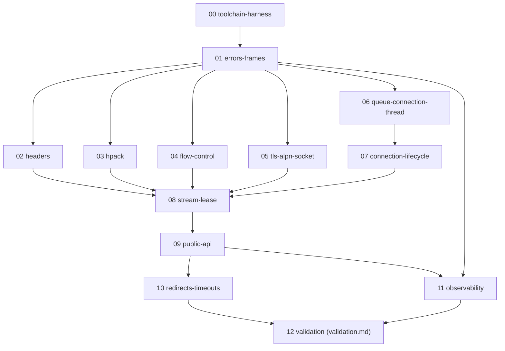

# http2client — Implementation Plan

Plan to build the Object Pascal HTTP/2 client described in `doc/design/`.
The normative specification lives there; **the plan only adds tasks,
sequencing, ownership, and acceptance criteria.** Where a design detail
already exists, stories link to it instead of restating it.

- Spec hub: [`../doc/http2client.md`](../doc/http2client.md)
- Design notes: [`../doc/design/`](../doc/design/)
- Verified toolchain behaviour: [`../doc/reference/fpc-verified/`](../doc/reference/fpc-verified/)

This repository is a git repo; deliverables are committed on `main` and also
live as files on disk.

## Dependency graph

Executable node id = story filename under `plan/stories/` (or
`plan/validation.md` for S12). Edge `A --> B` means *B implements after A's
deliverable exists*.



Critical path: `S00 → S01 → S03 → S08 → S09 → S10 → S12`
(HPACK is the longest of the parallel primitive track; TLS `S05` is the
highest-risk track and must start first among the parallel group).

### Lanes

```
Phase 0  Foundation   S00 ─────────────────────────────────────────────┐
Phase 1  Core frame   ─────── S01 ─────────────────────────────────────┤
Phase 2  Primitives   ─────────────┬─ S02 headers ─────────────────────┤
   (parallel)                      ├─ S03 hpack  ─────────────────────┤
                                   ├─ S04 flow-control ───────────────┤
                                   └─ S05 tls-alpn-socket ────────────┤
Phase 3  Transport     ────────────┴─ S06 queue+thread ── S07 lifecycle┤
Phase 4  Session/API   ────────────────────────────── S08 ── S09 ──────┤
Phase 5  Semantics     ────────────────────────────────────┬─ S10 ─────┤
                                                           └─ S11 ─────┤
Phase 6  Validation    ────────────────────────────────────────────── S12
```

Cross-lane dependencies the lane sketch compresses: `S02/S03/S04/S05/S07 → S08`, and `S11` (observability) also consumes `S01`'s frame/error types, not only `S09`. The mermaid graph above is normative for the exact edge set; the lane sketch is a reading aid.

### Parallel tracks

| Track | Stories | Starts after | Notes |
|---|---|---|---|
| A — Foundation | S00, S01 | — | One writer; every other track waits on the frozen `Http2.Errors`/`Http2.Frames` surface. |
| B — Codec & control | S02, S03, S04 | S01 | Three independent units; can run fully concurrently. |
| C — TLS | S05 | S01 | **Highest risk** (ALPN). Give it its own agent and start it first. |
| D — Transport | S06, S07 | S01 / S06 | One writer on `Http2.Connection`. |
| E — Session & API | S08, S09, S10, S11 | sequential | S08 then S09; S10 ∥ S11 after S09. |
| F — Validation | S12 | S10, S11 | Integrates the external harnesses. |

## Phases and deliverables

| Phase | Stories | Exit criterion |
|---|---|---|
| 0 Foundation | S00 | `make -C plan/skeleton` (or story Makefile) builds a hello-world that links all nine `Http2.*` unit stubs; `nghttpd`/docker harness pinned in `toolchain.md`. |
| 1 Frame core | S01 | `Http2.Errors` + `Http2.Frames` round-trip every frame type; unit tests green. |
| 2 Primitives | S02–S05 | Headers, HPACK round-trip, flow-control windows, and a TLS socket that negotiates `h2` via ALPN against `nghttpd`. |
| 3 Transport | S06, S07 | One connection thread owns a socket, drives preface/SETTINGS/PING/GOAWAY; queue tests green. |
| 4 Session/API | S08, S09 | `Send` completes a real GET/POST over a live connection; pool caps enforced; factory API compiles per `testclient`. |
| 5 Semantics | S10, S11 | Redirects, timeouts/cancellation, observer and mock-socket seams tested. |
| 6 Validation | S12 | `nghttpd` interop green; h2-test-harness suite run and reported; `http2/http2-test` intents ported. |

## Agent-team ownership

Each story is one **writer** (single agent edits those files); reviewers are
separate fresh-context agents. No two stories write the same unit
concurrently — parallel tracks own disjoint units.

| Story | Owner agent | Writes | Reads/reviews |
|---|---|---|---|
| S00 | foundation | `plan/toolchain.md`, build files | — |
| S01 | foundation | `src/Http2.Errors.pas`, `src/Http2.Frames.pas` | S00 |
| S02 | codec | `src/Http2.Headers.pas` | S01 |
| S03 | codec | `src/Http2.Hpack.pas` | S01 |
| S04 | control | `src/Http2.FlowControl.pas` | S01 |
| S05 | tls | `src/Http2.Tls.pas` | S01 |
| S06 | transport | `src/Http2.Connection.pas` (queue+thread) | S01 |
| S07 | transport | `src/Http2.Connection.pas` (lifecycle) | S06 |
| S08 | session | `src/Http2.Stream.pas` | S02–S07 |
| S09 | session | `src/Http2.Client.pas` | S08 |
| S10 | api | `src/Http2.Client.pas` (redirects/timeouts) | S09 |
| S11 | api | `src/Http2.Observer.pas`, `test/` seams | S01, S09 |
| S12 | validation | `test/validation/`, `plan/validation.md` | all |

## Unit ownership map (one writer per file)

| Unit | Owning story |
|---|---|
| `Http2.Errors` | S01 |
| `Http2.Frames` | S01 |
| `Http2.Headers` | S02 |
| `Http2.Hpack` | S03 |
| `Http2.FlowControl` | S04 |
| `Http2.Tls` | S05 |
| `Http2.Connection` | S06 (create), S07 (lifecycle) |
| `Http2.Stream` | S08 |
| `Http2.Client` | S09 (create), S10 (extend) |
| `Http2.Observer` | S11 |

## Global "done when"

1. Every story's acceptance command passes on `fpc 3.2.4` / macOS aarch64.
2. `Http2.Tls` negotiates `h2` via ALPN against a real TLS server (S05).
3. End-to-end: a compiler-built CLI completes GET, POST, streaming upload,
   and HEAD against `nghttpd` (S12.A).
4. `h2-client-test-harness` suite has been run; results recorded with the
   exact pass/fail set and any skipped cases justified (S12.B).
5. `http2/http2-test` client case intents are represented as mock-socket
   unit tests, with the draft-09 divergence documented (S12.C).
6. No unit exceeds the agreed size/`{$mode}`/directive conventions stated in
   `doc/design/fpc-runtime.md`.

## Story index

| File | Story |
|---|---|
| [`stories/00-toolchain-harness.md`](stories/00-toolchain-harness.md) | Toolchain, build, and harness bootstrap |
| [`stories/01-errors-frames.md`](stories/01-errors-frames.md) | Error model and frame codec |
| [`stories/02-headers.md`](stories/02-headers.md) | Headers and header names |
| [`stories/03-hpack.md`](stories/03-hpack.md) | HPACK codec |
| [`stories/04-flow-control.md`](stories/04-flow-control.md) | Flow control |
| [`stories/05-tls-alpn-socket.md`](stories/05-tls-alpn-socket.md) | TLS, ALPN, and socket abstraction |
| [`stories/06-queue-connection-thread.md`](stories/06-queue-connection-thread.md) | Blocking queue and connection thread |
| [`stories/07-connection-lifecycle.md`](stories/07-connection-lifecycle.md) | Connection lifecycle |
| [`stories/08-stream-lease.md`](stories/08-stream-lease.md) | Stream lease state machine |
| [`stories/09-public-api.md`](stories/09-public-api.md) | Public API, pool, request/response |
| [`stories/10-redirects-timeouts.md`](stories/10-redirects-timeouts.md) | Redirects, timeouts, cancellation |
| [`stories/11-observability.md`](stories/11-observability.md) | Observability and test seams |
| [`validation.md`](validation.md) | External validation (S12) |
